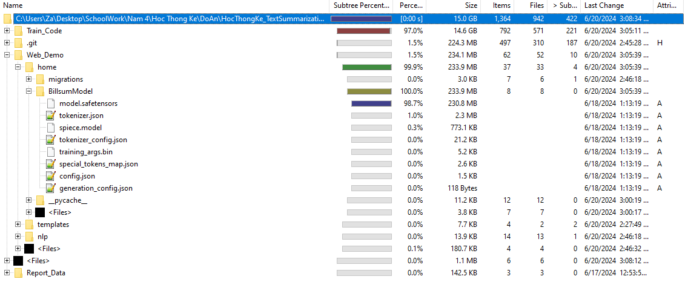

# Text Summarization Demo Project
20120070 - Huỳnh Thiết Gia - 20120070@student.hcmus.edu.vn  
20120151 - Nguyễn Thành Nhân - 20120151@student.hcmus.edu.vn    
Ho Chi Minh University of Science
## How to install 
### Prepare environment
* Install python 3.11
### Installing neccessary libraries
#### The script way
* Open command prompt.
* `cd` to the "HocThongKe_TextSummarization" folder.  
* Run command `pip install -r requirements.txt` to install libraries.  
#### Alternative for windows users: The bat file
* Alternatively, double click the InstallScript.bat file to install libraries.
### Download model and copy to directory
* Go to the directory "Web_Demo/home/".
* Get the model file from [this link](https://studenthcmusedu-my.sharepoint.com/:u:/g/personal/20120070_student_hcmus_edu_vn/EewqtGi8wTJOmvuzib5eTLUBzJDVPDl5B-2Dz6Zip3wyGA?e=Hd0IjA) and extract the folder inside that zip file to the "Web_Demo/home/" folder.  
The folder structure should look like this:  
  
### Run program
#### The script way
* `cd Web_Demo` 
* Type the command `python manage.py runserver 8888`.
* Type `localhost:8888` on your browser to access the web page 
#### Alternative for windows users: The bat file
* Alternatively, navigate to the "Web_Demo" folder and double click the RunWebDemo.bat file to start the web server.  
* Type `localhost:8888` on your browser to access the web page 
