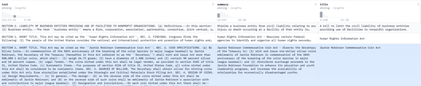

# Text Summarization
## Dataset
(https://huggingface.co/datasets/billsum).  
Dataset được sử dụng là dataset BillSum, gồm các dự luật của quốc hội Mỹ và bang California (“US Congressional and California state bills”) và tóm tắt của chúng.  
Bao gồm các đặc trưng: Nội dung của Bill, tóm tắt, tiêu đề (chỉ có với dự luật quốc hội, không có với California), độ dài của nội dung, độ dài tóm tắt.  

  
*Ảnh chụp một phần dữ liệu gốc chưa qua tiền xử lý.*  
## Tiền xử lý dataset  
```
from transformers import AutoTokenizer
tokenizer = AutoTokenizer.from_pretrained("google-t5/t5-small")
```
## Model  
[Blog của Google về model](https://research.google/blog/exploring-transfer-learning-with-t5-the-text-to-text-transfer-transformer/).  
Model được sử dụng là *google-t5/t5-small* bởi Google, nó là một model ứng dụng transformer với input/output đều là văn bản (Khác với model Bart của Google).  
Mục tiêu của họ khi tạo ra model này là dùng nó cho nhiều tác vụ khác nhau với một model duy nhất, một metric duy nhất, một thuật toán tối ưu duy nhất.  
 
## Metric  
Metric được sử dụng là Rogue  
