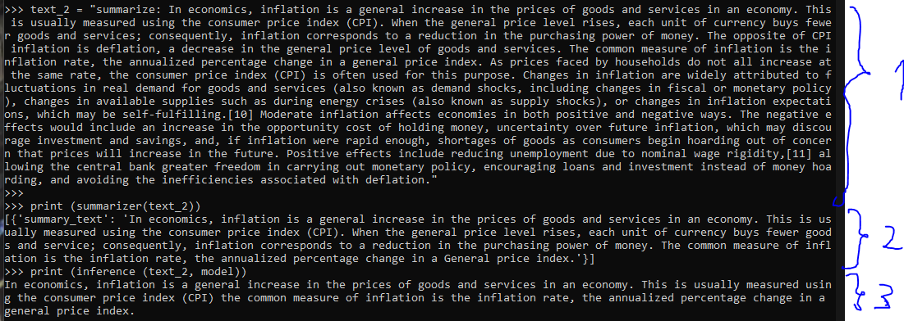

# Text Summarization
[Blog của Google về Model và Dataset](https://research.google/blog/exploring-transfer-learning-with-t5-the-text-to-text-transfer-transformer/).  
[Trang thông tin chi tiết về Dataset](https://huggingface.co/datasets/billsum).  
## Dataset
Dataset được sử dụng là dataset BillSum, gồm các dự luật của quốc hội Mỹ và bang California (“US Congressional and California state bills”) và tóm tắt của chúng.  
Bao gồm các đặc trưng: Nội dung của Bill, tóm tắt, tiêu đề (chỉ có với dự luật quốc hội, không có với California), độ dài của nội dung, độ dài tóm tắt.  

  
*Ảnh chụp một phần dữ liệu gốc chưa qua tiền xử lý.*  

## Tiền xử lý dataset  
```
from transformers import AutoTokenizer
tokenizer = AutoTokenizer.from_pretrained("google-t5/t5-small")
```  
Dữ liệu được tokenized theo như báo cáo của mô hình gốc, bao gồm các bước:  
	Một  
	Hai  
	Ba  
	Bốn  
	Năm  
test
## Model  
Model được sử dụng là *google-t5/t5-small* bởi Google.  
Mục tiêu của họ khi tạo ra model này là dùng nó cho nhiều tác vụ khác nhau với một model duy nhất, một metric duy nhất, một thuật toán tối ưu duy nhất nhằm đơn giản hóa quá trình so sánh giữa các bộ dữ liệu và các bài toán khác nhau.
Nó là một model ứng dụng Transformer với input/output đều là văn bản (Khác với model Bart, cũng của Google).  
Tuy nhiên về cái cốt lõi của Transformer thì không có sự thay đổi đáng kể nên nhóm tác giả đã hướng người đọc tới báo cáo gốc của Transformer để hiểu rõ hơn.  
  
"We use a simplified form of position embeddings
where each “embedding” is simply a scalar that is added to the corresponding logit used
for computing the attention weights. For efficiency, we also share the position embedding
parameters across all layers in our model, though within a given layer each attention head
uses a different learned position embedding"
"To summarize, our model is roughly equivalent to the original Transformer proposed by
Vaswani et al. (2017) with the exception of removing the Layer Norm bias, placing the layer
normalization outside the residual path, and using a different position embedding scheme.
Since these architectural changes are orthogonal to the experimental factors we consider in
our empirical survey of transfer learning, we leave the ablation of their impact for future
work."
  
Đây là hỏi chatGpt để đọc, mà thấy không đáng tin tí nào cả nên thôi chắc xóa phần này rồi đọc paper cho chắc  
"Certainly! The architecture of the Text-to-Text Transfer Transformer (T5) model is based on the Transformer architecture, which has been highly successful in natural language processing (NLP) tasks. Here are the key components:

Encoder-Decoder Structure:
T5 follows the standard Transformer architecture, consisting of an encoder and a decoder.
The encoder processes the input text, while the decoder generates the output text.
Both encoder and decoder consist of multiple layers of self-attention and feed-forward neural networks.
Unified Text-to-Text Format:
T5 reframes all NLP tasks into a consistent format: both input and output are treated as text strings.
This allows T5 to handle a wide range of tasks without task-specific modifications.
Pre-training and Fine-tuning:
T5 is pre-trained on a large corpus of text data using unsupervised learning.
During pre-training, it learns to predict masked tokens (similar to BERT) and also learns to generate text.
Fine-tuning involves training T5 on specific downstream tasks with labeled data.
Task-Specific Heads:
T5 uses task-specific heads (output layers) for different tasks.
For example, a translation task would have a different head than a summarization task.
Shared Vocabulary:
T5 uses a shared vocabulary for both input and output tokens.
This simplifies the model and allows it to handle diverse tasks.
Task Prefixes:
T5 introduces task-specific prefixes to guide the model during fine-tuning.
For instance, a translation task might have the prefix “Translate English to French: …”
Overall, T5’s strength lies in its versatility—it can be fine-tuned for various NLP tasks by simply adjusting the task-specific head and providing appropriate prefixes during fine-tuning. 😊🚀

If you have any more questions or need further details, feel free to ask!"
  
  
### Pre-train dataset
Model đã được pre-train trên tập dataset *Colossal Clean Crawled Corpus (C4)*.
"""To address these issues, we used the following
heuristics for cleaning up Common Crawl’s web extracted text:
• We only retained lines that ended in a terminal punctuation mark (i.e. a period,
exclamation mark, question mark, or end quotation mark).
• We discarded any page with fewer than 3 sentences and only retained lines that
contained at least 5 words.
• We removed any page that contained any word on the “List of Dirty, Naughty, Obscene
or Otherwise Bad Words”.6
• Many of the scraped pages contained warnings stating that Javascript should be
enabled so we removed any line with the word Javascript.
• Some pages had placeholder “lorem ipsum” text; we removed any page where the
phrase “lorem ipsum” appeared.
• Some pages inadvertently contained code. Since the curly bracket “{” appears in
many programming languages (such as Javascript, widely used on the web) but not in
natural text, we removed any pages that contained a curly bracket.
• Since some of the scraped pages were sourced from Wikipedia and had citation markers
(e.g. [1], [citation needed], etc.), we removed any such markers.
• Many pages had boilerplate policy notices, so we removed any lines containing the
strings “terms of use”, “privacy policy”, “cookie policy”, “uses cookies”, “use of
cookies”, or “use cookies”.
• To deduplicate the data set, we discarded all but one of any three-sentence span
occurring more than once in the data set."""
## Metric  
Metric được sử dụng là Rogue Metric.


## Kết quả huấn luyện  
Khá tốt, so sánh trực tiếp với kết quả của model có sẵn thì cho thấy nó output giống nhau.  
Cho thấy quá trình huấn luyện đã thành công. 
  
*Ảnh chụp so sánh giữa output của mô hình huấn luyện được (3) và mô hình có sẵn (2)*  